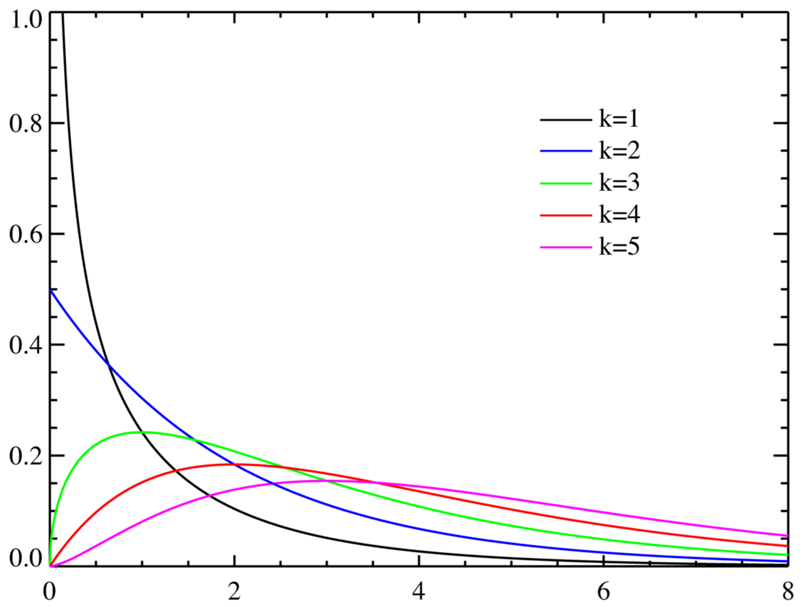
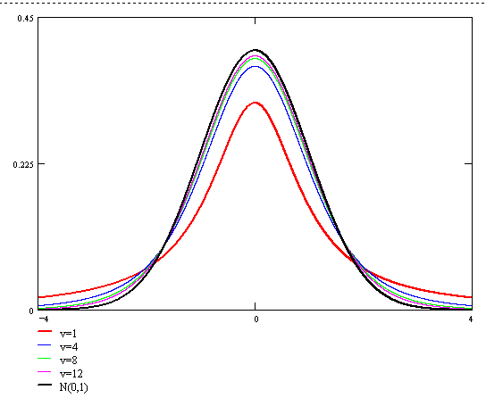

## 理论铺垫（Part 1）
- 集中趋势：均值、中位数与分位数、众数
- 离中趋势：标准差、方差
- 数据分布：偏态与峰态、正态分布与三大分布
- 抽样理论：抽样误差、抽样精度

### 集中趋势
集中趋势是数据聚拢位置的的衡量。
- 均值、中位数、众数、分位数
- 四分位数计算方法 
    Q1的位置$=(n+1) \cdot 0.25$ 
    Q2的位置$=(n+1) \cdot 0.5$ 
    Q3的位置$=(n+1) \cdot 0.75$

### 离中趋势
离中趋势是数据离散程度的衡量。
- 标准差、方差

    $$\sigma = \sqrt{\frac{1}{N} \sum_{i=1}^{N}{(x_i - \mu)^2}}$$

    数据落在$1 \cdot \sigma$的概率为$69\%$；落在$1.96 \cdot \sigma$的概率为$95\%$；落在$2.58 \cdot \sigma$的概率为$99\%$。

### 数据分布：偏态与峰态
- 偏态系数与峰态系数 
    偏态系数是数据均值偏离状态的衡量，偏态的偏是指均值的偏。

    偏态系数：

    $$S = \frac{\frac{1}{n} \sum_{i=1}^{n}{(x_i - \bar{x})^3}}{(\frac{1}{n} \sum_{i=1}^{n}{(x_i - \bar{x})^2})^\frac{3}{2}}$$

    如果$S>0$，为正偏，均值比较大；反之，如果$S<0$，为负偏，均值比较小。

    偏态系数是数据分布集中强度的衡量。

    峰态系数：

    $$K = \frac{\frac{1}{n} \sum_{i=1}^{n}{(x_i - \bar{x})^4}}{(\frac{1}{n} \sum_{i=1}^{n}{(x_i - \bar{x})^2})^2}$$

    此公式下，正态分布的峰态系数为3。如果$K<1$或者$K>5$可以认为此分布不是正态分布（？？）。

### 数据分布：分布概率
- 正态分布与三大分布
    - 正态分布：

    $$f(x) = \frac{1}{\sqrt{2\pi}\sigma} e^{ -\frac{(x-\mu)^2}{2\sigma^2} }$$

    - 卡方分布 
    如果$X_i \sim \mathcal{N}(0,1)$，那么$\sum{X_i^2} \sim \chi_k^2$
    
    

    - t分布 
    用于根据小样本，估计呈正态分布且方差未知的总体的均值。 
    正态分布的一个随机变量 除以一个卡方分布的变量 就是t

    

    - F分布 
    两个卡方分布的商

    

### 抽样理论
- 抽样误差与精度
    
    抽样平均误差计算公式：

    重复抽样：

    $$\mu_x = \sqrt{\frac{\sigma^2}{n}}$$

    不重复抽样：

    $$\mu_x = \sqrt{\frac{\sigma^2}{n} {\frac{(N-n)}{(N-1)}}}$$

    估计总体时抽样数目的确定：

    重复抽样：

    $$n = \frac{Z_{\alpha/2}^2 \delta^2}{\Delta^2}$$

    不重复抽样：

    $$n = \frac{N Z_{\alpha/2}^2 \delta^2}{N\Delta^2 + Z_{\alpha/2}^2 \delta^2}$$

- 例：

    某鱼塘进行抽样调查，从鱼塘不同部位共网到150条鱼，草鱼123条，草鱼平均2公斤，标准差0.75公斤，95.45%概率保证，估计草鱼平均每条的重量。

    由于$n=123$，$\sigma=0.75$，所以

    $$\mu_x = \sqrt{\frac{\sigma^2}{n}} = 0.07$$

    最后，结果为$2 \pm 2 \cdot 0.07$，$95%$的概率重量在$[1.86, 2.14]$内。

- 例：

    某鱼塘进行抽样调差，草鱼总量1000条，标准差0.75公斤，误差不超过0.5公斤，概率保证95.45%，估计草鱼平均每条的重量，需要捞几条草鱼。

    由于$N=1000$，$\delta=0.75$，$\Delta=0.5$，$Z_{\alpha/2}=2$，所以

    $$n = \frac{N Z_{\alpha/2}^2 \delta^2}{N\Delta^2 + Z_{\alpha/2}^2 \delta^2}=9$$

Note:
The relative Jyputer Notebooks in Code folder are:
- 2.0.1 statistic knowledge.ipynb