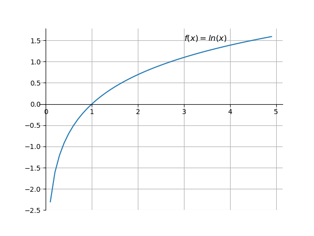

## 3. 预处理理论

想说一个比预处理更大的概念：__特征工程__。

数据集越大，数据质量越好，数据模型的复杂度越低；反之，数据集越小，数据质量越差，要达到同样的效果，数据的复杂度就越高。

__数据和特征决定了机器学习的上限，而模型和算法只是逼近这个上限而已。__

特征工程一般包括：
- 特征使用
    - 数据的选择
    - 数据的可用性判断
- 特征获取
    - 特征来源的确认
    - 特征存储
- 特征处理
    - 数据清洗
    - 数据预处理
- 特征监控
    - 现有特征
    - 新特征

### 3.1 数据清洗
- 数据样本抽样
- 异常值（空值）处理

#### 3.1.1 数据样本采集（抽样）
需要注意的是：
- 样本要具备代表性
- 样本比例要平衡以及样本不平衡是如何处理
- 考虑全量数据

#### 3.1.2 异常值（空值）处理
在之前的探索性分析中，也讨论过。
- 识别异常值和重复值 `Pandas: isnull()/duplicated()`
- 直接丢弃（包括重复数据） `Pandas: drop()/dropna()/drop_duplicated()`
- 当是否有异常值当做一个新的属性，代替原值 `Pandas: fillna()`
- 集中值指代 `Pandas: fillna()`
- 边界值指代 `Pandas: fillna()`
- 插值 `Pandas: interpolate() -- Series`

例如：

<table>
    <tr>
        <td>A</td>
        <td>B</td>
        <td>C</td>
        <td>D</td>
        <td>E</td>
        <td>F</td>
    </tr>
    <tr>
        <td>a0</td>
        <td>b0</td>
        <td>1</td>
        <td>0.1</td>
        <td>10</td>
        <td>f0</td>
    </tr>
    <tr>
        <td>a1</td>
        <td>b1</td>
        <td>2</td>
        <td>10.2</td>
        <td>19</td>
        <td>f1</td>
    </tr>
    <tr>
        <td>a1</td>
        <td>b2</td>
        <td></td>
        <td>11.4</td>
        <td>32</td>
        <td>g2</td>
    </tr>
    <tr>
        <td>a2</td>
        <td>b2</td>
        <td>3</td>
        <td>8.9</td>
        <td>25</td>
        <td>f3</td>
    </tr>
    <tr>
        <td>a3</td>
        <td>b3</td>
        <td>4</td>
        <td>9.1</td>
        <td>8</td>
        <td>f4</td>
    </tr>
    <tr>
        <td>a4</td>
        <td></td>
        <td>5</td>
        <td>12</td>
        <td></td>
        <td>f5</td>
    </tr>
</table>

Note:
The relative Jyputer Notebooks in Code folder are:
- 3.1 outlier.ipynb

### 3.2 特征预处理

首先需要了解：标注（也可以称为标记、标签、label）

特征预处理主要包括以下内容：
- 特征选择
- 特征变换
    - 对指化、离散化、数据平滑、归一化（标准化）、数值化、正规化
- 特征降维
- 特征衍生

#### 3.2.1 特征选择

特征选择的含义是：剔除与标注不相关或者冗余的特征，减少特征的个数。其效果是减少模型训练的时间。

之前提到的PCA、奇异值变换等通过变换的方式降维的方法，这些对特征的降维的处理方式，可以叫做特征提取，既然是提取就少不了变。本节中的特征选择，则是依靠统计学方法、或者数据模型、机器学习模型本身的特征，进行与标注影响大小的排序后，剔除排序靠后的特征，实现降维。特征选择可以放在特征处理前进行，也可以在特征变化后进行。

特征选择是数据归约的一种方式，另一种方式是抽样。
特征选择有三个切入思路：
- 过滤思想

    直接评价某个特征与标注的相关性的特征，如果与标注的相关性特别小就去掉。

- 包裹思想

    含义：假设所有特征是个集合$X$，最佳的特征组合是它的一个子集，我们任务是要找到这样子集。我们需要先确定一个评价指标，比如正确率，于是我们可以遍历特征子集，找到正确率评价下最佳的子集；也可以一步步进行迭代，比如我们先拆分成几个大点的子集${X_1, X_2, ..., X_N}$，如果这个时候确定了最优的特征子集，就针对这个特征子集进行接下来的拆分，知道我们的评价指标下降过快，或者低于阈值的时候，整个过程结束。这种思想下有种常用的方法：RFE（Recursive Feature Elimination）。

    RFE算法过程有三步：
    - 列出特征集合$X:{X_1, X_2, ..., X_N}$；
    - 构造简单的模型进行训练，根据系数去掉比较弱的特征；
    - 余下的特征重复过程，知道评价指标下降较大或者低于阈值，停止。

- 嵌入思想

    嵌入的主体是特征，被嵌入的主体是一个简单的模型，也就是说根据一个简单的模型来分析特征的重要性。最常见的方法使用正则化的方式来做特征选择。通过一个回归模型，对标注进行回归，对得到的系数进行正则化。这时，这些系数反映了这些特征的重要性。

Note:
The relative Jyputer Notebooks in Code folder are:
- 3.2.1 Feature Selection.ipynb

#### 3.2.2 特征变换
- 对指化

    对数据进行对数化与指数化的过程。

    - 指数化
        $f(x) = \exp{(x)}$

        

        例如：$Y_1 = 0.3, Y_2 = 0.3, Y_3 = 0.4$，通过$exp$计算，得到$Y_1 = 1.35, Y_2 = 1.35, Y_3 = 1.49$，进行归一化后得到$Y_1 = 0.32, Y_2 = 0.32, Y_3 = 0.36$。
    - 对数化
        $f(x) = \log{(x)}$

        

    代码通常使用：
    - np.log
    - np.exp
- 离散化

    将连续数据变换成离散数据的操作。一般将连续变量分成几段（bins）。之所以需要离散化，有以下几个原因：
    - 克服数据缺陷

        连续数据的信息会有很多，但其中可能会有噪声
    - 某些算法要求

        例如，朴素贝叶斯算法
    - 非线数据映射

        例如，分布会有明显的拐点，连续数据在不同的区间内会有不同的含义
    
    三种离散化的方法，前两种属于数据分箱技术：
    - 等频（又称等深）
    - 等距（又称等宽）
    - 自因变量优化

        根据自变量、因变量的有序分布，找到拐点等特殊变化点，进行离散化。
    
    数据在进行封箱前一定要进行排序，既然是一个箱子，就一定有深度与宽度，对于数据来说，它的深度就是数据的个数；而它的宽度就是它的区间。例如：

    6   8   10   15   16   24   25   40   67

    - 等深封箱，比如要分三个数据箱，于是有一下结果：

        6   8   10 | 15   16   24 | 25   40   67

        封箱过后，会有一个值来替代箱子里的数据。替代方法有很多，例如使用均值、边界值。
    
    - 等宽封箱，每个箱子的区间尽量一致，比如要分三个数据箱，于是有一下结果：

        6   8   10   15   16   24   25 | 40 | 67

- 归一化（标准化）
    - 归一化

        是一种数据变换方法，即最小化最大化的一种特殊形式。将数据所触及的范围缩放到一定的指定大小范围内。所谓的归一化，就是将数据转化为0到1之间的范围，即最小值是0，最大值是1。

        Min - Max:

        $$x' = \frac{x-x_{min}}{x_{max} - x_{min}}$$

        例如：
        1, 4, 10, 15, 21

        归一化后为
        0, 0.06, 0.45, 0.7, 1

    - 标准化

        将数据转化成标准的形式。例如：归一化。这里的标准化是比较狭义的，它是指将数据缩放到均值为0，标准差为1的尺度上。这种转化叫做z-score，也即z得分标准化。

        Z-score:

        $$x' = \frac{x-\bar{x}}{\sigma}$$

        例如：
        1, 1, 1, 1, 0, 0, 0, 0

        标准化后为
        1, 1, 1, 1, -1, -1, -1, -1

        又如：
        1, 0, 0, 0, 0, 0, 0, 0

        标准化后为
        2.64, -0.38, -0.38, -0.38, -0.38, -0.38, -0.38, -0.38

- 数值化

    把非数值数据转化成数值数据的过程。之前有提到4中数据类型：
    - 定类：属性间没有大小关系；
    - 定序：虽然属性间有大小关系，但关系不可衡量；
    - 定距：属性间的大小可以衡量，但是没有零点，无法乘除；
    - 定比：定距的基础上加上零点，可以乘除、

    定类、定序数据无法进行距离建的比较和加减法运算；而定距数据虽然可以进行加减法的运算，但不能进行乘除法的运算。这三类数据虚根据实际情况进行转换。

    定距数据需要通过归一化；而定类、定序数据需要通过数值化，从而可以进行四则运算。

    - 定序数据的数值化 - 标签化（Label Encode）

        对数据直接进行数值标签的转化，用0、1、2等代替原来的数值属性.

        例如：
        Down -> 0; Up -> 1

        又如：
        Low -> 0; Medium -> 1; High -> 2
    - 定类数据的数值化 - 独热（One-Hot Encode）

        例如： 
        Red -> [1, 0, 0, 0] 
        Yello -> [0, 1, 0, 0] 
        Blue -> [0, 0, 1, 0] 
        Green -> [0, 0, 0, 1] 

- 正规化