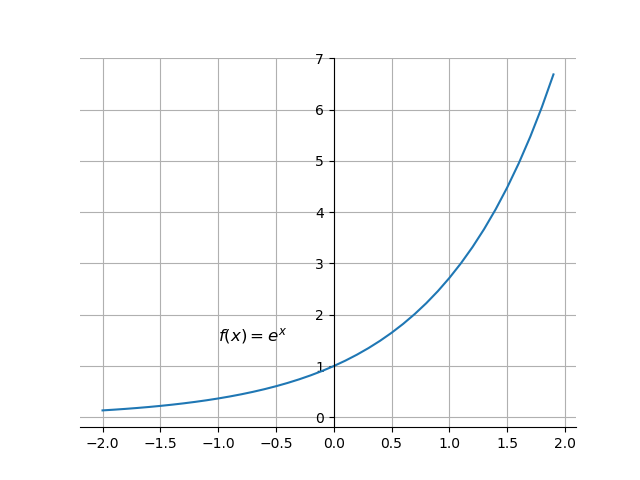

## 3. 预处理理论

想说一个比预处理更大的概念：__特征工程__。

数据集越大，数据质量越好，数据模型的复杂度越低；反之，数据集越小，数据质量越差，要达到同样的效果，数据的复杂度就越高。

__数据和特征决定了机器学习的上限，而模型和算法只是逼近这个上限而已。__

特征工程一般包括：
- 特征使用
    - 数据的选择
    - 数据的可用性判断
- 特征获取
    - 特征来源的确认
    - 特征存储
- 特征处理
    - 数据清洗
    - 数据预处理
- 特征监控
    - 现有特征
    - 新特征

### 3.1 数据清洗
- 数据样本抽样
- 异常值（空值）处理

#### 3.1.1 数据样本采集（抽样）
需要注意的是：
- 样本要具备代表性
- 样本比例要平衡以及样本不平衡是如何处理
- 考虑全量数据

#### 3.1.2 异常值（空值）处理
在之前的探索性分析中，也讨论过。
- 识别异常值和重复值 `Pandas: isnull()/duplicated()`
- 直接丢弃（包括重复数据） `Pandas: drop()/dropna()/drop_duplicated()`
- 当是否有异常值当做一个新的属性，代替原值 `Pandas: fillna()`
- 集中值指代 `Pandas: fillna()`
- 边界值指代 `Pandas: fillna()`
- 插值 `Pandas: interpolate() -- Series`

例如：

<table>
    <tr>
        <td>A</td>
        <td>B</td>
        <td>C</td>
        <td>D</td>
        <td>E</td>
        <td>F</td>
    </tr>
    <tr>
        <td>a0</td>
        <td>b0</td>
        <td>1</td>
        <td>0.1</td>
        <td>10</td>
        <td>f0</td>
    </tr>
    <tr>
        <td>a1</td>
        <td>b1</td>
        <td>2</td>
        <td>10.2</td>
        <td>19</td>
        <td>f1</td>
    </tr>
    <tr>
        <td>a1</td>
        <td>b2</td>
        <td></td>
        <td>11.4</td>
        <td>32</td>
        <td>g2</td>
    </tr>
    <tr>
        <td>a2</td>
        <td>b2</td>
        <td>3</td>
        <td>8.9</td>
        <td>25</td>
        <td>f3</td>
    </tr>
    <tr>
        <td>a3</td>
        <td>b3</td>
        <td>4</td>
        <td>9.1</td>
        <td>8</td>
        <td>f4</td>
    </tr>
    <tr>
        <td>a4</td>
        <td></td>
        <td>5</td>
        <td>12</td>
        <td></td>
        <td>f5</td>
    </tr>
</table>

Note:
The relative Jyputer Notebooks in Code folder are:
- 3.1 outlier.ipynb

### 3.2 特征预处理

首先需要了解：标注（也可以称为标记、标签、label）

特征预处理主要包括以下内容：
- 特征选择
- 特征变换
    - 对指化、离散化、数据平滑、归一化（标准化）、数值化、正规化
- 特征降维
- 特征衍生

#### 3.2.1 特征选择

特征选择的含义是：剔除与标注不相关或者冗余的特征，减少特征的个数。其效果是减少模型训练的时间。

之前提到的PCA、奇异值变换等通过变换的方式降维的方法，这些对特征的降维的处理方式，可以叫做特征提取，既然是提取就少不了变。本节中的特征选择，则是依靠统计学方法、或者数据模型、机器学习模型本身的特征，进行与标注影响大小的排序后，剔除排序靠后的特征，实现降维。特征选择可以放在特征处理前进行，也可以在特征变化后进行。

特征选择是数据归约的一种方式，另一种方式是抽样。
特征选择有三个切入思路：
- 过滤思想

    直接评价某个特征与标注的相关性的特征，如果与标注的相关性特别小就去掉。

- 包裹思想

    含义：假设所有特征是个集合$X$，最佳的特征组合是它的一个子集，我们任务是要找到这样子集。我们需要先确定一个评价指标，比如正确率，于是我们可以遍历特征子集，找到正确率评价下最佳的子集；也可以一步步进行迭代，比如我们先拆分成几个大点的子集${X_1, X_2, ..., X_N}$，如果这个时候确定了最优的特征子集，就针对这个特征子集进行接下来的拆分，知道我们的评价指标下降过快，或者低于阈值的时候，整个过程结束。这种思想下有种常用的方法：RFE（Recursive Feature Elimination）。

    RFE算法过程有三步：
    - 列出特征集合$X:{X_1, X_2, ..., X_N}$；
    - 构造简单的模型进行训练，根据系数去掉比较弱的特征；
    - 余下的特征重复过程，知道评价指标下降较大或者低于阈值，停止。

- 嵌入思想

    嵌入的主体是特征，被嵌入的主体是一个简单的模型，也就是说根据一个简单的模型来分析特征的重要性。最常见的方法使用正则化的方式来做特征选择。通过一个回归模型，对标注进行回归，对得到的系数进行正则化。这时，这些系数反映了这些特征的重要性。

Note:
The relative Jyputer Notebooks in Code folder are:
- 3.2.1 Feature Selection.ipynb

#### 3.2.2 特征变换
- 对指化
    $f(x) = \exp{(x)}$
    
    $f(x) = \log{(x)}$
    
    - np.log
    - np.exp
- 离散化
- 数据平滑
- 归一化（标准化）
- 数值化
- 正规化